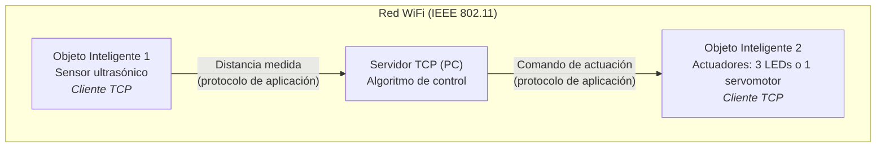

# Práctica 2 — Integración de Objetos Inteligentes con TCP/IP

**Carrera:** Ingeniería de Sistemas
**Asignatura:** SIS-234
**Modalidad:** grupos de 2 o 3 integrantes
**Fecha límite de entrega:** martes 13 de octubre de 2026

---

## 1. Nombre de la Actividad Evaluativa

**Integración de Objetos Inteligentes con TCP/IP.**

---

## 2. Propósito de la Actividad Evaluativa

Evaluar el desarrollo de los siguientes saberes:

### 2.1 Saber Conceptual
- Redes de sensores IP sobre IEEE 802.11.
- Modelo TCP/IP.
- Arquitectura cliente-servidor.
- Protocolos de transporte (TCP).

### 2.2 Saber Procedimental
- Configura conectividad en redes IP (WiFi – IEEE 802.11).
- Implementa comunicación cliente-servidor mediante sockets TCP.
- Diseña e implementa un protocolo de aplicación simple para el intercambio de datos entre clientes y servidor.

### 2.3 Saber Actitudinal (Saber Ser)
- Colaboración con sus compañeros.
- Responsabilidad en la ejecución de las actividades asignadas.
- Orden, sistematicidad y disciplina durante el análisis, diseño y construcción del prototipo.

---

## 3. Descripción de la Actividad

Se deberá diseñar e implementar un sistema distribuido compuesto por:

- **1 Objeto Inteligente** con sensor ultrasónico (cliente).
- **1 Objeto Inteligente** con actuadores, mínimo **3 LEDs** o **1 servomotor** (cliente).
- **1 Servidor TCP** (PC) que actuará como entidad central de control.

> Ambos objetos inician la conexión TCP hacia el servidor; las flechas indican el sentido del flujo de datos. El diagrama es referencial: cada grupo debe elaborar su propio diagrama de arquitectura y de secuencia (§4.2).

El servidor deberá ejecutar un **algoritmo de control** que:

1. Procese la información obtenida del sensor ultrasónico.
2. Active los actuadores de acuerdo con criterios previamente definidos.

### 3.1 Requerimientos Funcionales Mínimos

El sistema deberá cumplir, como mínimo, con los siguientes requerimientos:

- **RF1.** Medir la distancia entre el sensor ultrasónico y un objeto.
- **RF2.** Interpretar la distancia medida y clasificarla en al menos **tres rangos** contiguos y sin solapamiento.
- **RF3.** Activar los actuadores en función del rango de distancia detectado, con un comportamiento distinto para cada rango.
- **RF4.** El objeto con sensor envía las lecturas al servidor y el servidor envía los comandos al objeto con actuadores mediante **sockets TCP sobre WiFi (IEEE 802.11)**, utilizando un **protocolo de aplicación** definido por el grupo.

Cada grupo deberá **definir y documentar sus propios rangos, su lógica de control y su protocolo de aplicación** en el informe. Las tablas siguientes son únicamente **ejemplos ilustrativos**.

**Ejemplo A — variante con 3 LEDs:**

| Distancia medida | Comportamiento |
|------------------|----------------|
| < 50 cm          | LED rojo parpadeando |
| ≥ 50 cm y < 100 cm | LED naranja parpadeando |
| ≥ 100 cm         | LED verde encendido |

**Ejemplo B — variante con 1 servomotor:**

| Distancia medida | Comportamiento |
|------------------|----------------|
| < 50 cm          | Servo a 0° |
| ≥ 50 cm y < 100 cm | Servo a 90° |
| ≥ 100 cm         | Servo a 180° |

> Nota: los valores de los rangos y la lógica de control de los ejemplos no son obligatorios; lo obligatorio son RF1, RF2, RF3 y RF4.

### 3.2 Requerimientos No Funcionales

El sistema debe ser **estable y confiable**. Cada grupo deberá declarar y **verificar en la sección de Pruebas y Validaciones** al menos los siguientes atributos, con valores medibles:

- **Estabilidad:** operación continua durante un tiempo mínimo declarado (referencia: ≥ 10 minutos) sin reinicios ni bloqueos.
- **Exactitud de medición:** error máximo respecto a una referencia física, p. ej. una cinta métrica (referencia: ≤ ±3 cm dentro del rango de trabajo declarado).
- **Tiempo de respuesta:** el actuador debe reflejar el cambio de rango en un tiempo máximo declarado, medido de extremo a extremo: sensor → servidor → actuador (referencia: ≤ 1 s).
- **Frecuencia de muestreo:** número mínimo de lecturas por segundo declarado (referencia: ≥ 2 lecturas/s).

El código debe ser **legible, modular (orientado a objetos), documentado y conforme a las convenciones de codificación del lenguaje utilizado**.

---

## 4. Entregables

### 4.1 Prototipo Funcional
Se deberá presentar un prototipo completamente operativo que demuestre la integración entre los distintos componentes del sistema.

### 4.2 Informe Técnico

El informe se entrega en **formato Markdown**, dentro del repositorio de la práctica (ver sección 6), y debe contener las siguientes secciones mínimas:

1. **Requerimientos Funcionales y No Funcionales**
2. **Análisis y Diseño**
   - Diagrama de arquitectura del sistema (bloques o despliegue)
   - Diagrama de circuito de cada objeto inteligente
   - Diagrama de clases (estructural)
   - Diagrama de secuencia (comportamiento), que incluya el intercambio de mensajes entre clientes y servidor
   - Especificación del protocolo de aplicación (formato de los mensajes y su secuencia)
3. **Desarrollo e Implementación**
   - Descripción de la estructura del código (módulos y clases principales) y explicación de los fragmentos clave, con enlaces al código fuente del repositorio (no se copia el código completo en el informe)
4. **Pruebas y Validaciones**
5. **Resultados**
6. **Conclusiones**
7. **Recomendaciones**
8. **Anexos**

---

## 5. Evaluación

### 5.1 Ponderación

| Componente | Peso |
|-------------|-------------|
| Informe Técnico | 1/3 |
| Demo | 1/3 |
| Defensa Individual | 1/3 |

- El **Informe Técnico** se califica con una rúbrica de **4 criterios de 0 a 4 puntos** (16 puntos máximo): nota del componente = `(puntos obtenidos / 16) × 100`.
- La **Demo** y la **Defensa Individual** se califican de forma **global, con un único nivel de 0 a 4**: nota del componente = `(nivel obtenido / 4) × 100`.

La nota final es el promedio de los tres componentes.

En los tres casos, el nivel **0 — No presentado** aplica cuando lo evaluado no se entrega, no se presenta o no puede evidenciarse.

---

### 5.2 Rúbrica del Informe Técnico (1/3)

#### 5.2.1 Criterios de Evaluación

| Criterio | Puntuación |
|------------|--------------|
| Requerimientos, análisis y diseño | 0 – 4 |
| Desarrollo e implementación (código y documentación) | 0 – 4 |
| Pruebas y validaciones | 0 – 4 |
| Resultados, conclusiones y recomendaciones | 0 – 4 |

> El funcionamiento del prototipo en vivo no se evalúa aquí, sino en la Demo (§5.3).

#### 5.2.2 Rúbrica Analítica

**Requerimientos, análisis y diseño**

| Nivel | Descripción |
|----------|---------------|
| **4 - Excelente** | Requerimientos funcionales y no funcionales completos, medibles y trazables al diseño. Incluye todos los diagramas exigidos en §4.2 (arquitectura, circuito de cada objeto, clases y secuencia) y la especificación completa del protocolo de aplicación. Los diagramas permiten comprender totalmente el sistema y su secuencia de ejecución. |
| **3 - Satisfactorio** | Requerimientos definidos y diagramas claros que explican el funcionamiento general del sistema. |
| **2 - Satisfactorio con recomendaciones** | Requerimientos imprecisos o diagramas incompletos o con poca claridad. |
| **1 - Necesita mejorar** | Falta uno o más diagramas esenciales, o los requerimientos no están definidos. |
| **0 - No presentado** | La sección no fue entregada. |

**Desarrollo e implementación (código y documentación)**

| Nivel | Descripción |
|----------|---------------|
| **4 - Excelente** | Código bien estructurado, modular (POO), documentado y con buenas prácticas. La implementación descrita cubre todos los requerimientos declarados. |
| **3 - Satisfactorio** | Código estructurado y coherente con los requerimientos, con documentación básica. |
| **2 - Satisfactorio con recomendaciones** | Código con mala organización o sin convenciones claras. |
| **1 - Necesita mejorar** | Código incompleto, sin documentación o que no corresponde a los requerimientos declarados. |
| **0 - No presentado** | No se entregó código fuente. |

**Pruebas y validaciones**

| Nivel | Descripción |
|----------|---------------|
| **4 - Excelente** | Plan de pruebas completo que verifica los requerimientos funcionales y los valores declarados en los no funcionales, con documentación detallada y análisis de errores si corresponde. |
| **3 - Satisfactorio** | Plan de pruebas adecuado con documentación básica. |
| **2 - Satisfactorio con recomendaciones** | Plan incompleto con validaciones parciales. |
| **1 - Necesita mejorar** | Pruebas insuficientes. |
| **0 - No presentado** | No se documentaron pruebas. |

**Resultados, conclusiones y recomendaciones**

| Nivel | Descripción |
|----------|---------------|
| **4 - Excelente** | Resultados cuantificables, análisis crítico, conclusiones fundamentadas y recomendaciones técnicas. Anexos pertinentes. |
| **3 - Satisfactorio** | Resultados medibles con conclusiones coherentes. |
| **2 - Satisfactorio con recomendaciones** | Resultados limitados, conclusiones básicas, sin recomendaciones. |
| **1 - Necesita mejorar** | Resultados poco claros o no medibles. |
| **0 - No presentado** | La sección no fue entregada. |

---

### 5.3 Rúbrica de la Demo (1/3)

La demostración se califica de forma global con un único nivel de 0 a 4.

| Nivel | Descripción |
|----------|---------------|
| **4 - Excelente** | El prototipo opera de forma completa y estable, con la comunicación entre objetos pasando por el servidor TCP vía WiFi; responde correctamente en todos los rangos, incluidos los casos límite solicitados durante la demostración. Montaje ordenado y seguro. |
| **3 - Satisfactorio** | El prototipo cumple todos los requerimientos funcionales, con fallas menores que no impiden la demostración. |
| **2 - Satisfactorio con recomendaciones** | El prototipo funciona parcialmente: algún rango o actuador no responde como fue especificado. |
| **1 - Necesita mejorar** | Prototipo no funcional o con fallas críticas durante la demostración. |
| **0 - No presentado** | No se presentó el prototipo. |

---

### 5.4 Rúbrica de la Defensa Individual (1/3)

La defensa se califica de forma global con un único nivel de 0 a 4.

| Nivel | Descripción |
|----------|---------------|
| **4 - Excelente** | Responde con precisión y profundidad, explica cualquier parte del código y del circuito, y justifica técnicamente las decisiones tomadas. Su aporte al grupo es claro y verificable en el historial de commits del repositorio. |
| **3 - Satisfactorio** | Responde correctamente sobre el conjunto del trabajo, con dudas en aspectos puntuales. |
| **2 - Satisfactorio con recomendaciones** | Conoce solo la parte en la que trabajó directamente; explicaciones superficiales. |
| **1 - Necesita mejorar** | No logra explicar el funcionamiento del sistema ni justificar las decisiones de diseño. |
| **0 - No presentado** | No se presentó a la defensa. |

---

## 6. Entrega Final

**Qué se entrega:** un repositorio GitHub que contenga:

- El **informe técnico** en formato Markdown, con la estructura de §4.2.
- El **código fuente** documentado.
- Los **anexos** (diagramas, esquemas, fotografías y evidencias de las pruebas).

Cada integrante debe realizar **commits con su propia cuenta de GitHub**; el historial de commits se utiliza como evidencia de su aporte en la Defensa Individual (§5.4).

**Cómo se entrega:** el **enlace del repositorio GitHub** se envía por el **LMS-UCB**.

**Cuándo:** hasta el **martes 13 de octubre de 2026**.

> El repositorio debe estar accesible para el docente en la fecha de entrega. Solo se evalúa el contenido existente en el repositorio hasta esa fecha; un enlace inaccesible equivale a trabajo no entregado. La entrega del enlace por el LMS es responsabilidad de cada grupo, y basta con que la realice un integrante.

---
